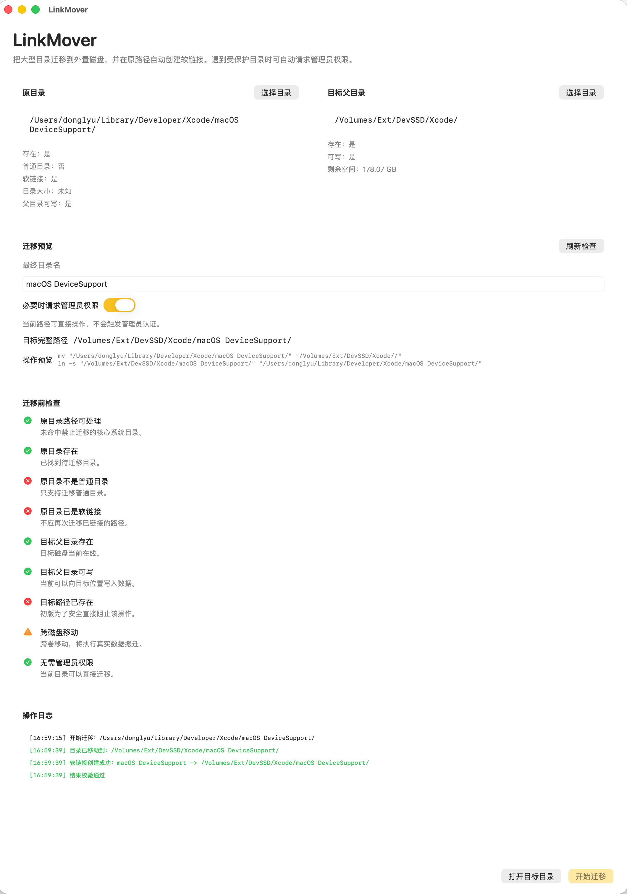

# LinkMover

[English README](README.en.md)

一个简洁的 macOS 小工具，用于把大型目录迁移到外置磁盘或其他位置，并在原路径创建软链接，尽量不影响原有开发环境和工具链。

起因： 公司的电脑硬盘有点小，开发环境需要的硬盘空间又很大，所以外接了固态硬盘，因此有了这个工具，能够一定程度上减轻内置硬盘的压力，避免频繁清理磁盘空间。

## 界面

## 功能

- 选择原目录和目标父目录
- 预览最终迁移路径和执行命令
- 检查目录是否存在、是否可写、剩余空间是否足够
- 阻止迁移关键系统路径
- 必要时请求管理员权限
- 迁移后自动创建软链接
- 提供日志、回滚和重建软链接能力
- 支持中文和英文界面切换

## 适用场景

- 把 Xcode 相关缓存或设备支持目录迁移到外置 SSD
- 把占空间较大的开发目录迁移到其他磁盘
- 保留原路径，避免手动修改依赖路径的工具或脚本

## 使用方式

1. 打开应用，选择要迁移的原目录。
2. 选择目标父目录。
3. 确认最终目录名、预检查结果和权限提示。
4. 点击 `开始迁移`。
5. 迁移完成后，原路径会变成指向新位置的软链接。

如果迁移后软链接创建失败，应用会保留恢复原位置和重建软链接的操作入口。

## 注意事项

- 不支持直接迁移根目录和核心系统目录。
- 目标路径如果已存在，当前版本会直接阻止操作。
- 迁移前请确认没有应用正在占用该目录。
- 涉及受保护目录时，macOS 可能会弹出管理员认证。

## 构建

使用 Xcode 打开 [LinkMover.xcodeproj](/Volumes/Ext/CodeE/Code_Lab/Dev_Tools/LinkMover/LinkMover.xcodeproj) 并运行 `LinkMover` scheme。
